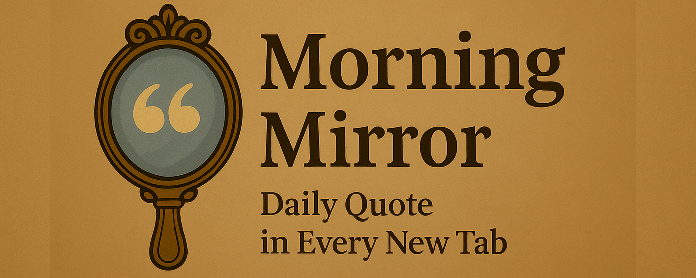
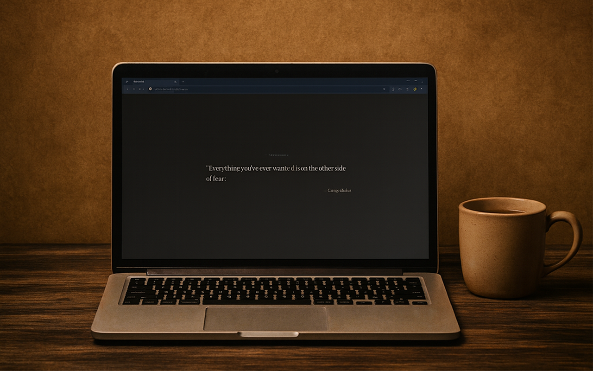

# Morning Mirror

[](https://chromewebstore.google.com/detail/morning-mirror/hngafcfepedchmjlkogfniagockdpnjl)

**A calming new-tab experience with a daily quote.**  
Every time you open a new tab, Morning Mirror greets you with a rustic, minimalist design and an inspiring quote to start your day.

<p align="center">
  
</p>

---

## ✨ Features

- 🪞 **Minimalist new tab** – No clutter, just a serene background and a daily quote.
- 📜 **Fresh quotes** – A new thought each day to inspire or provoke reflection.
- 🎨 **Rustic aesthetic** – Warm, calming visuals for a distraction-free moment.
- ⚡ **Lightweight** – No tracking, no analytics, no ads.

---

## 📦 Installation

**Chrome Web Store:** [Install Morning Mirror](https://chromewebstore.google.com/detail/morning-mirror/hngafcfepedchmjlkogfniagockdpnjl)  

---

<p align="center">
  
</p>

---

## 🛠 Development

1. Clone the repo:
   ```bash
   git clone https://github.com/bepost/MorningMirror.git
   cd MorningMirror
   ```

2. Install dependencies:
   ```bash
   npm install
   ```
   
3. Build:
   ```bash
   npm run build
   ```
   
4. Load the extension in Chrome:

   * Go to `chrome://extensions/`
   * Enable **Developer mode**
   * Click **Load unpacked**
   * Select the `dist` folder

---

## 📜 License

MIT License – feel free to fork and modify.

---

## 💡 Contributing

Suggestions and contributions are welcome!
If you have ideas for features, quote sources, or visual styles, please open an issue or PR.
